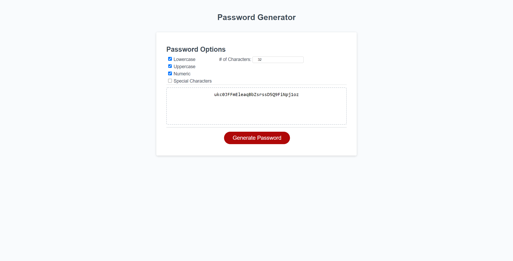

# Web Based Password Generator
A password generator created using HTML, CSS and JavaScript. You are able to select the types of characters via check boxes that you want to be included in your password along with the length of the password desired (between 8-128 characters) and it will be generated for you. The logic for generation along with validation of user entry is in the script.js file. 

The following selections for password complexity can be made:
* Lowercase
* Uppercase
* Numeric
* Special Characters

It can be viewed live here: https://davidtunnell.github.io/web-based-password-generator/

# Screenshot
